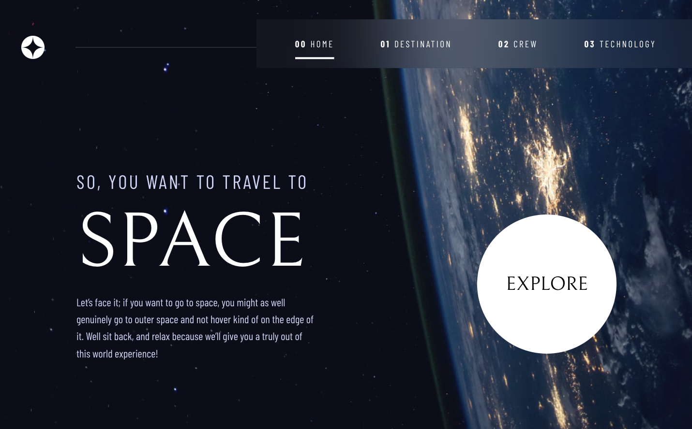
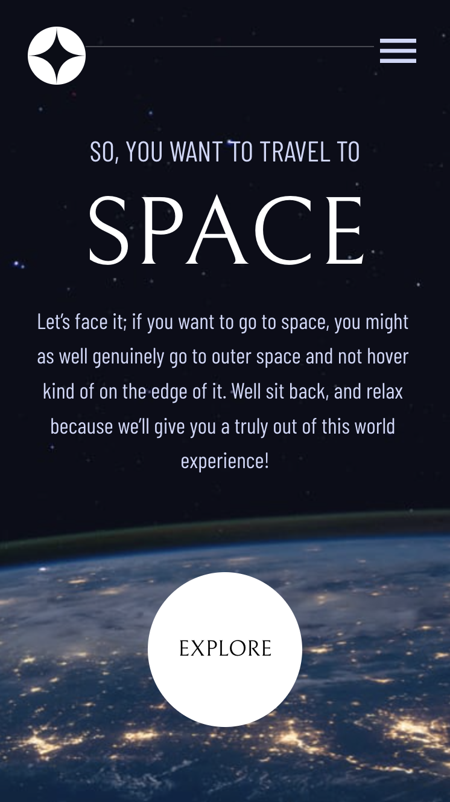

# 🪐Space Tourism website

This is a solution to the [Space tourism website challenge on Frontend Mentor](https://www.frontendmentor.io/challenges/space-tourism-multipage-website-gRWj1URZ3). It was built with React js, using CSS, HTML and JavaScript.
## Table of contents

  - [The challenge](#the-challenge)
  - [Screenshot](#screenshot)
  - [Links](#links)
  - [Built with](#built-with)
- [Author](#author)

### 💡The challenge

Users should be able to:

- View the optimal layout for each of the website's pages depending on their device's screen size
- See hover states for all interactive elements on the page
- View each page and be able to toggle between the tabs to see new information
- Use swipe-carrousel in mobile and tablet, with auto-cycle function
### 📷Screenshot

- Desktop: 

- Mobile: 

### 📌Links

- Live Site URL: [Live site url](https://mariapenaa.github.io/space-landingpage/)

### 🔨Built with

- Semantic HTML5 markup
- CSS custom properties
- SASS
- Flexbox
- [React](https://reactjs.org/) - JS library

### 💁🏽‍♀️Author

<!-- - Website - [Maria Peña](https://www.your-site.com) -->
- Frontend Mentor - [@mariapenaa](https://www.frontendmentor.io/profile/mariapenaa)

